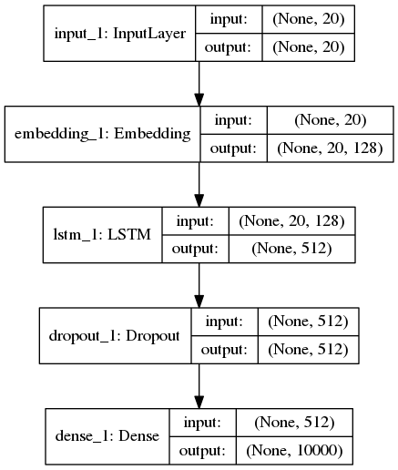

# Next Word Prediction of a Sentence


### Using Natural Language Processing with Deep Learning
## Libraries
- [Keras](https://keras.io/)
- [Tensorflow](https://www.tensorflow.org/)
## Setup
- Install the requirements.

```pip install -r requirements.txt```

- Prepare Dataset for training.

```python prepare_data.py```

- Train the data.

```python train.py```

You could tune the Parameters by spectifying in settings.py file

## Google Colab
Enter and run the following snippet in the first cell to train in Google Colab environment. Don't forget to set hardware acceleration to GPU to speed up training!

```
!git init && git remote add origin https://github.com/VinayTurpati/next-word-prediction.git && git pull origin master
!pip install -r requirements.txt
```

## LSTM Model:

